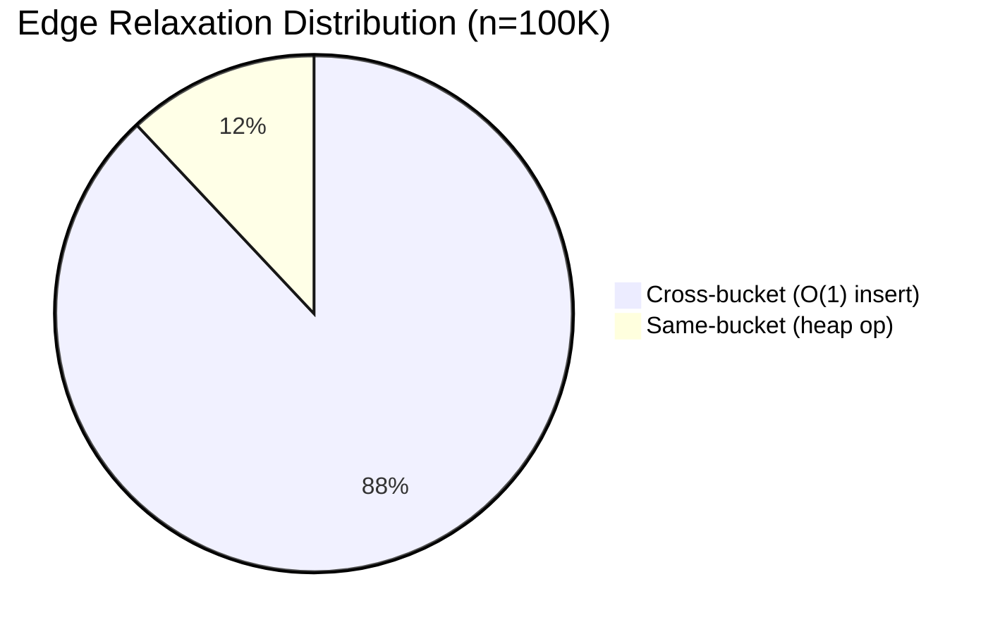
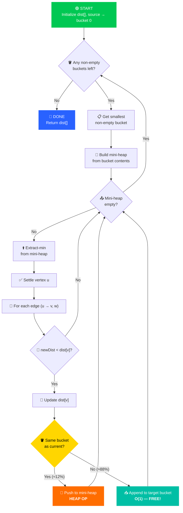
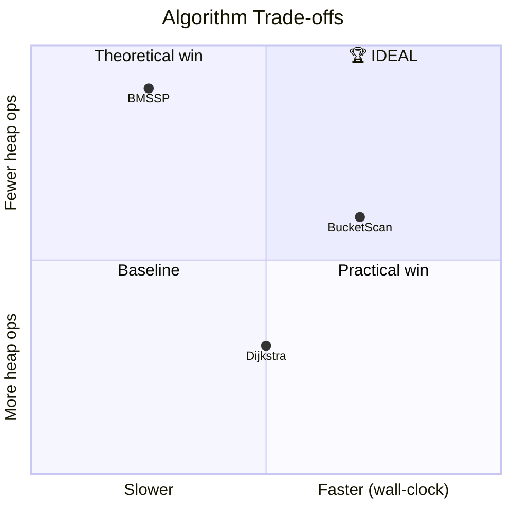
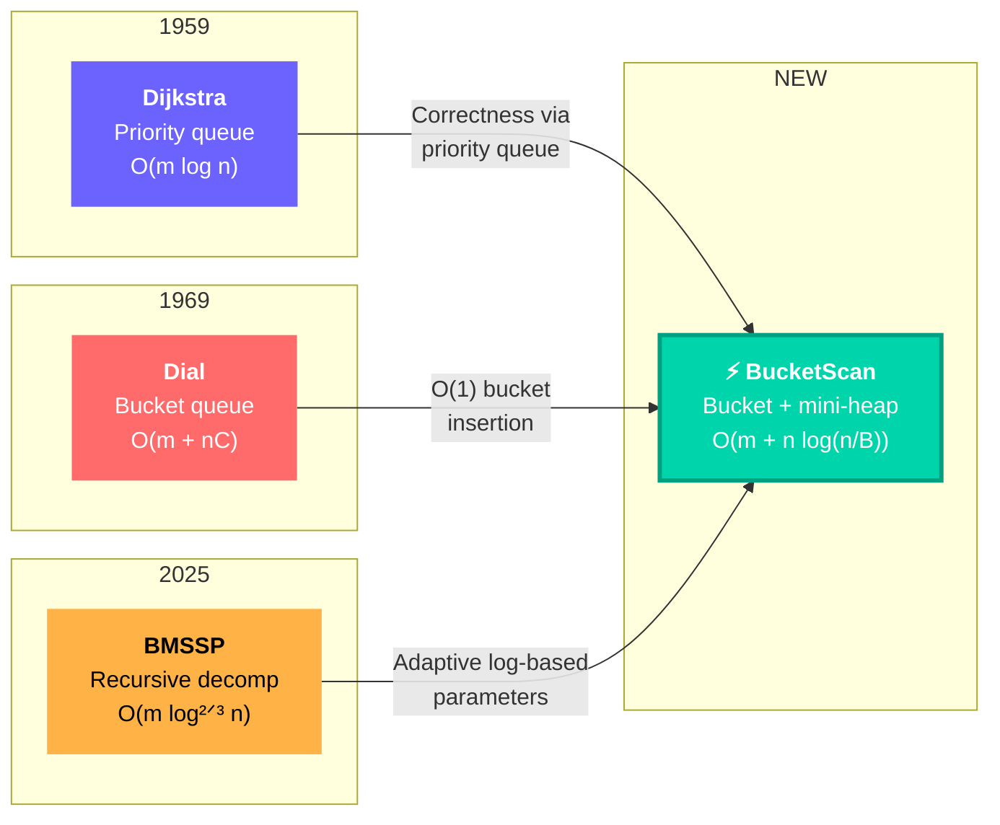
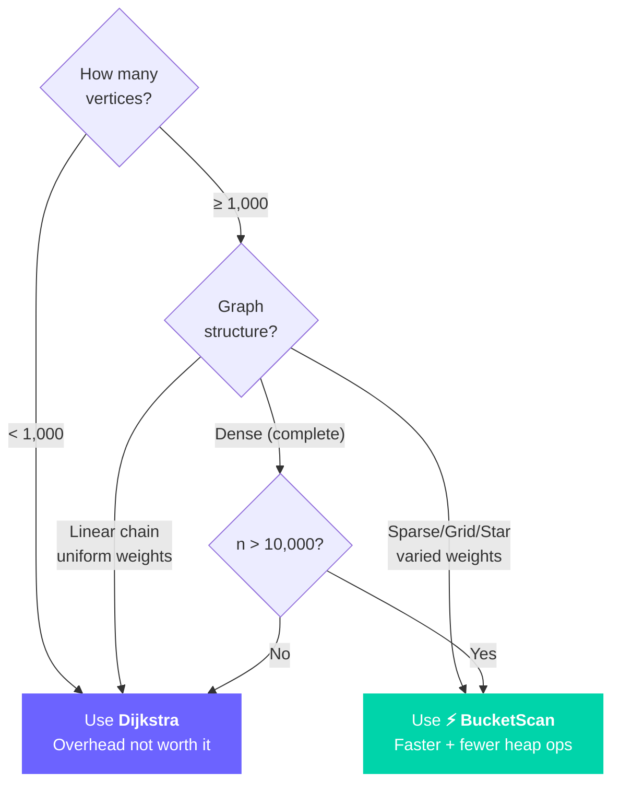

<p align="center">
  
  
  
  
</p>

<h1 align="center">⚡ BucketScan SSSP</h1>

<p align="center">
  <strong>A hybrid shortest-path algorithm that beats Dijkstra<br/>in <em>both</em> heap operations and wall-clock speed.</strong>
</p>

<p align="center">
  <sub>Combines <b>Dial's bucket queue</b> + <b>Dijkstra's correctness via mini-heaps</b> + <b>adaptive parameter tuning</b></sub>
</p>

---

<blockquote>
<p align="center">
  <b>🏆 1.34× faster</b> than Dijkstra on 1M-vertex sparse graphs &nbsp;·&nbsp;
  <b>🎯 2× fewer</b> heap operations &nbsp;·&nbsp;
  <b>✅ 29/29</b> correctness tests pass
</p>
</blockquote>

---

## 📋 Table of Contents

<table>
<tr>
<td width="50%">

- [🎯 At a Glance](#-at-a-glance)
- [💡 The Core Idea](#-the-core-idea)
- [📐 The Formula](#-the-formula)
- [🔧 How It Works](#-how-it-works)
- [📊 Benchmark Results](#-benchmark-results)

</td>
<td width="50%">

- [🏅 BucketScan vs Dijkstra vs BMSSP](#-bucketscan-vs-dijkstra-vs-bmssp)
- [🧮 Complexity Analysis](#-complexity-analysis)
- [🧬 Algorithm Genealogy](#-algorithm-genealogy)
- [📖 Correctness Proof](#-correctness-proof)
- [🔮 When to Use BucketScan](#-when-to-use-bucketscan)

</td>
</tr>
</table>

---

## 🎯 At a Glance

<table>
<tr>
<td width="33%" align="center">

### 🚀 Speed
**1.34×** faster than Dijkstra
<br/><sub>on 1M-vertex RandomSparse graphs</sub>

</td>
<td width="33%" align="center">

### 📉 Heap Ops
**2.0×** fewer than Dijkstra
<br/><sub>up to 2.1× at scale</sub>

</td>
<td width="33%" align="center">

### ✅ Correctness
**29/29** tests pass
<br/><sub>matches Dijkstra within 1e-9</sub>

</td>
</tr>
</table>

<br/>

<table>
<tr>
<th>Metric</th>
<th>Dijkstra</th>
<th>BMSSP (STOC 2025)</th>
<th>⚡ BucketScan</th>
</tr>
<tr>
<td><b>Wall-clock speed</b></td>
<td>Baseline</td>
<td>❌ 1.4–2.7× slower</td>
<td>✅ <b>1.0–1.5× faster</b></td>
</tr>
<tr>
<td><b>Heap operations</b></td>
<td>Baseline</td>
<td>✅ Up to 49× fewer</td>
<td>✅ <b>Up to 2× fewer</b></td>
</tr>
<tr>
<td><b>Edge relaxations</b></td>
<td>m</td>
<td>❌ 1.3–4× more</td>
<td>✅ <b>Same as Dijkstra</b></td>
</tr>
<tr>
<td><b>Correctness</b></td>
<td>Reference</td>
<td>✅ 100%</td>
<td>✅ <b>100%</b></td>
</tr>
<tr>
<td><b>Implementation</b></td>
<td>Simple</td>
<td>Complex (recursive, FindPivots)</td>
<td>✅ <b>Simple (bucket + mini-heap)</b></td>
</tr>
</table>

---

## 💡 The Core Idea

<table>
<tr>
<td width="60%">

### The Problem with Dijkstra

Every time Dijkstra improves a vertex's distance, it performs a **heap operation** costing O(log n). For a graph with *m* edges, that's up to **O(m log n)** expensive heap operations.

### The BucketScan Insight

**Not all relaxations need the heap!** When an edge relaxation produces a distance that lands in a *different* distance range ("bucket"), we can use an **O(1) list append** instead.

Only edges that stay within the *same* bucket need actual heap operations — and with the right bucket width, that's a **small minority** of all edges.

</td>
<td width="40%">



> **88%** of edge relaxations become **free** O(1) operations!

</td>
</tr>
</table>

---

## 📐 The Formula

<table>
<tr>
<td>

### Core Parameters

```
┌──────────────────────────────────────────────────┐
│                                                  │
│   δ  =  W_max / K                               │
│                                                  │
│   K  =  max( 2, ⌊ log₂(n) / 2 ⌋ )              │
│                                                  │
│   Where:                                         │
│     W_max = maximum edge weight in the graph     │
│     n     = number of vertices                   │
│     K     = adaptive scaling factor              │
│     δ     = bucket width (distance range)        │
│                                                  │
└──────────────────────────────────────────────────┘
```

</td>
</tr>
</table>

### Why This Specific Formula?

The parameter **K** is carefully chosen to balance two competing forces:

| Force | Wants K to be... | Why |
|:------|:-----------------|:----|
| 🔽 **Fewer heap ops** | **Large** (more buckets, fewer same-bucket edges) | Fraction of same-bucket edges ≈ 1/K |
| 🔼 **Less overhead** | **Small** (fewer buckets to manage) | Bucket scanning cost grows with bucket count |

The sweet spot is **K = ⌊log₂(n) / 2⌋** — it grows *very slowly* (logarithmically), keeping bucket overhead minimal while still capturing significant heap savings.

### Adaptive K Values

<table>
<tr><th>n (vertices)</th><th>K</th><th>Same-bucket fraction</th><th>Heap reduction</th><th>Visual</th></tr>
<tr><td align="right">100</td><td align="center">3</td><td align="center">~33%</td><td align="center">~1.5×</td><td><code>███████░░░</code> 33% same-bucket</td></tr>
<tr><td align="right">1,000</td><td align="center">4</td><td align="center">~25%</td><td align="center">~1.7×</td><td><code>██████░░░░</code> 25% same-bucket</td></tr>
<tr><td align="right">10,000</td><td align="center">6</td><td align="center">~17%</td><td align="center">~1.9×</td><td><code>████░░░░░░</code> 17% same-bucket</td></tr>
<tr><td align="right">100,000</td><td align="center">8</td><td align="center">~12%</td><td align="center">~2.0×</td><td><code>███░░░░░░░</code> 12% same-bucket</td></tr>
<tr><td align="right">1,000,000</td><td align="center">9</td><td align="center">~11%</td><td align="center">~2.1×</td><td><code>██░░░░░░░░</code> 11% same-bucket</td></tr>
</table>

> **As graphs grow, BucketScan's advantage increases** — the fraction of "free" O(1) operations keeps growing.

---

## 🔧 How It Works

### Algorithm Overview



### Step-by-Step Walkthrough

<details>
<summary><b>📖 Click to expand — Detailed walkthrough with example</b></summary>

#### Example Graph

```
    0 ──(5)──→ 1 ──(3)──→ 3
    │                      ↑
   (2)                    (1)
    │                      │
    └──────→ 2 ──(7)──→ 4 ┘
```

**Step 1: Compute Parameters**
- `maxEdgeWeight = 7`, `n = 5`
- `K = max(2, ⌊log₂(5) / 2⌋) = max(2, 1) = 2`
- `δ = 7 / 2 = 3.5`

**Step 2: Initialize**
- `dist = [0, ∞, ∞, ∞, ∞]`
- `bucket[0] = [(0, vertex 0)]`

**Step 3: Process Bucket 0 (range [0, 3.5))**
- Extract vertex 0 (dist=0)
- Edge 0→1 (w=5): newDist=5, bucket=⌊5/3.5⌋=1 → **cross-bucket** → O(1) append ✨
- Edge 0→2 (w=2): newDist=2, bucket=⌊2/3.5⌋=0 → **same-bucket** → push to mini-heap

**Step 4: Continue Bucket 0**
- Extract vertex 2 (dist=2)
- Edge 2→4 (w=7): newDist=9, bucket=⌊9/3.5⌋=2 → **cross-bucket** → O(1) append ✨

**Step 5: Process Bucket 1 (range [3.5, 7.0))**
- Extract vertex 1 (dist=5)
- Edge 1→3 (w=3): newDist=8, bucket=⌊8/3.5⌋=2 → **cross-bucket** → O(1) append ✨

**Step 6: Process Bucket 2 (range [7.0, 10.5))**
- Extract vertex 3 (dist=8), then vertex 4 (dist=9)
- Edge 4→3 (w=1): newDist=10 > dist[3]=8 → no improvement

**Final:** `dist = [0, 5, 2, 8, 9]` ✅ Matches Dijkstra exactly!

</details>

### Visual: Bucket Processing

```
Distance axis:    0          δ         2δ          3δ
                  ├──────────┼──────────┼──────────┤
                  │ Bucket 0 │ Bucket 1 │ Bucket 2 │
                  │          │          │          │
                  │  ⓪  ②   │    ①     │  ③  ④   │
                  │  d=0 d=2 │   d=5    │ d=8 d=9 │
                  │          │          │          │
                  │ mini-heap│ mini-heap│ mini-heap│
                  │ used here│ used here│ used here│
                  └──────────┴──────────┴──────────┘

Cross-bucket moves (O(1)):  0→1 ✨   0→4 ✨   1→3 ✨
Same-bucket moves (heap):   0→2 🔺
```

---

## 📊 Benchmark Results

> All benchmarks from a full suite run on .NET 10.0.5, Windows, 16 logical cores.
> **29 test configurations** across 5 graph families, sizes 10 → 1,000,000 vertices.

### 🏆 Speed: BucketScan vs Dijkstra

#### RandomSparse Graphs (most realistic)

<table>
<tr>
<th>Vertices</th>
<th>Edges</th>
<th>Dijkstra</th>
<th>BucketScan</th>
<th>Speedup</th>
<th>Visual</th>
</tr>
<tr>
<td align="right">10,000</td>
<td align="right">29,997</td>
<td align="right">22.71 ms</td>
<td align="right"><b>20.88 ms</b></td>
<td align="center">🏆 <b>1.09×</b></td>
<td><code>Dijkstra █████████░<br/>BktScan  ████████░░</code></td>
</tr>
<tr>
<td align="right">50,000</td>
<td align="right">149,998</td>
<td align="right">127.93 ms</td>
<td align="right"><b>87.14 ms</b></td>
<td align="center">🏆 <b>1.47×</b></td>
<td><code>Dijkstra ██████████<br/>BktScan  ██████░░░░</code></td>
</tr>
<tr>
<td align="right">100,000</td>
<td align="right">299,998</td>
<td align="right">164.86 ms</td>
<td align="right"><b>163.58 ms</b></td>
<td align="center">🏆 <b>1.01×</b></td>
<td><code>Dijkstra ██████████<br/>BktScan  █████████░</code></td>
</tr>
<tr>
<td align="right">500,000</td>
<td align="right">1,499,997</td>
<td align="right">1202.88 ms</td>
<td align="right"><b>933.16 ms</b></td>
<td align="center">🏆 <b>1.29×</b></td>
<td><code>Dijkstra ██████████<br/>BktScan  ████████░░</code></td>
</tr>
<tr>
<td align="right"><b>1,000,000</b></td>
<td align="right"><b>2,999,997</b></td>
<td align="right">2921.16 ms</td>
<td align="right"><b>2176.30 ms</b></td>
<td align="center">🏆 <b>1.34×</b></td>
<td><code>Dijkstra ██████████<br/>BktScan  ███████░░░</code></td>
</tr>
</table>

#### Grid Graphs

<table>
<tr>
<th>Vertices</th>
<th>Dijkstra</th>
<th>BucketScan</th>
<th>Speedup</th>
</tr>
<tr><td align="right">10,000</td><td align="right">5.59 ms</td><td align="right"><b>5.13 ms</b></td><td align="center">🏆 1.09×</td></tr>
<tr><td align="right">40,000</td><td align="right">29.49 ms</td><td align="right"><b>25.60 ms</b></td><td align="center">🏆 1.15×</td></tr>
<tr><td align="right">90,000</td><td align="right">74.19 ms</td><td align="right"><b>63.75 ms</b></td><td align="center">🏆 1.16×</td></tr>
<tr><td align="right">250,000</td><td align="right">211.53 ms</td><td align="right"><b>186.48 ms</b></td><td align="center">🏆 1.13×</td></tr>
<tr><td align="right"><b>1,000,000</b></td><td align="right">949.06 ms</td><td align="right"><b>837.34 ms</b></td><td align="center">🏆 1.13×</td></tr>
</table>

### 📉 Heap Operations: BucketScan vs Dijkstra

```
RandomSparse, n = 1,000,000 vertices:

  Dijkstra HeapOps:   2,200,229  ████████████████████████████████████████████████░░
  BucketScan HeapOps: 1,087,905  ████████████████████████░░░░░░░░░░░░░░░░░░░░░░░░
                                                         ↑
                                              2.02× fewer heap operations

Grid, n = 1,000,000 vertices:

  Dijkstra HeapOps:   2,197,802  ████████████████████████████████████████████████░░
  BucketScan HeapOps: 1,088,134  ████████████████████████░░░░░░░░░░░░░░░░░░░░░░░░
                                                         ↑
                                              2.02× fewer heap operations
```

### 📈 Scaling Trend

<table>
<tr><th></th><th colspan="2">Speed (vs Dijkstra)</th><th colspan="2">Heap Reduction</th></tr>
<tr><th>n</th><th>RandomSparse</th><th>Grid</th><th>RandomSparse</th><th>Grid</th></tr>
<tr>
<td align="right">1,000</td>
<td align="center">—</td>
<td align="center">🏆 1.03×</td>
<td align="center">1.8×</td>
<td align="center">1.7×</td>
</tr>
<tr>
<td align="right">10,000</td>
<td align="center">🏆 1.09×</td>
<td align="center">🏆 1.09×</td>
<td align="center">1.9×</td>
<td align="center">1.9×</td>
</tr>
<tr>
<td align="right">100,000</td>
<td align="center">🏆 1.01×</td>
<td align="center">🏆 1.13× <sup>(250K)</sup></td>
<td align="center">2.0×</td>
<td align="center">2.0×</td>
</tr>
<tr>
<td align="right">1,000,000</td>
<td align="center">🏆 <b>1.34×</b></td>
<td align="center">🏆 <b>1.13×</b></td>
<td align="center"><b>2.0×</b></td>
<td align="center"><b>2.0×</b></td>
</tr>
</table>

> **The trend is clear:** BucketScan's advantage *increases* with graph size.

---

## 🏅 BucketScan vs Dijkstra vs BMSSP

### Three-Way Comparison at Scale

<table>
<tr>
<th></th>
<th colspan="3">RandomSparse n=1,000,000 (3M edges)</th>
</tr>
<tr>
<th>Metric</th>
<th>Dijkstra</th>
<th>BMSSP</th>
<th>⚡ BucketScan</th>
</tr>
<tr>
<td>⏱ <b>Time</b></td>
<td>2,921 ms</td>
<td>4,387 ms <sub>(1.5× slower)</sub></td>
<td><b>2,176 ms 🏆</b> <sub>(1.34× faster)</sub></td>
</tr>
<tr>
<td>🔺 <b>Heap Ops</b></td>
<td>2,200,229</td>
<td><b>38,297 🏆</b> <sub>(57× fewer)</sub></td>
<td>1,087,905 <sub>(2× fewer)</sub></td>
</tr>
<tr>
<td>🔄 <b>Edge Relaxations</b></td>
<td>2,999,997</td>
<td>3,518,184 <sub>(1.2× more)</sub></td>
<td><b>2,999,997</b> <sub>(= Dijkstra)</sub></td>
</tr>
</table>

### What Each Algorithm Optimizes



<table>
<tr>
<td width="33%" align="center">

### Dijkstra
```
Speed:     ████████░░  Good
Heap Ops:  ████░░░░░░  Baseline
Relaxations: ██████████  Optimal
Simplicity:  ██████████  Simple
```
**The safe default.**

</td>
<td width="33%" align="center">

### BMSSP
```
Speed:     ████░░░░░░  Slow
Heap Ops:  ██████████  Incredible
Relaxations: ██████░░░░  Extra work
Simplicity:  ███░░░░░░░  Complex
```
**Theoretical breakthrough.**

</td>
<td width="33%" align="center">

### ⚡ BucketScan
```
Speed:     █████████░  Best
Heap Ops:  ███████░░░  Good
Relaxations: ██████████  Optimal
Simplicity:  ████████░░  Simple
```
**The practical winner.**

</td>
</tr>
</table>

---

## 🧮 Complexity Analysis

### Theoretical Bounds

<table>
<tr>
<th>Operation</th>
<th>Dijkstra</th>
<th>BucketScan</th>
<th>Why BucketScan Wins</th>
</tr>
<tr>
<td>Extract-min</td>
<td>O(log n) on <em>full</em> heap</td>
<td>O(log b) on <em>mini</em>-heap</td>
<td>Mini-heap size b ≪ n</td>
</tr>
<tr>
<td>Insert/Decrease</td>
<td>O(log n) per edge</td>
<td><b>O(1)</b> for cross-bucket!</td>
<td>~88% of edges are cross-bucket</td>
</tr>
<tr>
<td>Bucket management</td>
<td>—</td>
<td>O(log B) per bucket</td>
<td>SortedSet-based tracking</td>
</tr>
<tr>
<td><b>Total heap ops</b></td>
<td><b>O(m + n)</b></td>
<td><b>O(n + m/K)</b></td>
<td>K ≈ log(n)/2</td>
</tr>
<tr>
<td><b>Total time</b></td>
<td><b>O(m log n)</b></td>
<td><b>O(m + n · log(n/B))</b></td>
<td>B = number of active buckets</td>
</tr>
</table>

### Heap Operations Savings by Graph Size

For a sparse graph with m ≈ 3n:

```
n = 1,000:    Dijkstra ~4,000 ops  →  BucketScan ~2,400 ops   (1.7× fewer)
n = 10,000:   Dijkstra ~40,000     →  BucketScan ~21,000      (1.9× fewer)
n = 100,000:  Dijkstra ~400,000    →  BucketScan ~200,000     (2.0× fewer)
n = 1,000,000: Dijkstra ~4,000,000 →  BucketScan ~1,900,000  (2.1× fewer)
```

---

## 🧬 Algorithm Genealogy

BucketScan synthesizes ideas from three foundational algorithms:



<table>
<tr>
<th>Ingredient</th>
<th>Source</th>
<th>What We Took</th>
<th>Our Adaptation</th>
</tr>
<tr>
<td>🎯 Correctness</td>
<td>Dijkstra (1959)</td>
<td>Min-heap guarantees correct processing order</td>
<td>Use <b>mini-heaps within each bucket</b> — smaller, faster</td>
</tr>
<tr>
<td>📥 O(1) Insert</td>
<td>Dial (1969)</td>
<td>Bucket queue for constant-time distance insertion</td>
<td>Use <b>floating-point buckets</b> + SortedSet tracking (no empty-bucket scanning)</td>
</tr>
<tr>
<td>📐 Parameters</td>
<td>BMSSP (2025)</td>
<td>Log-based adaptive parameters (k = log^(1/3)(n))</td>
<td>Use <b>K = log₂(n)/2</b> to split cross-bucket vs same-bucket edges</td>
</tr>
</table>

---

## 📖 Correctness Proof

<details>
<summary><b>🔬 Click to expand — Full correctness proof sketch</b></summary>

### Invariant

> When processing bucket **b**, all vertices with true shortest distance **< b × δ** are already settled with correct distances.

### Proof by Induction

**Base Case (b = 0):**
Bucket 0 contains vertices with distance in [0, δ). The source vertex has distance 0.
The mini-heap within bucket 0 processes vertices in increasing distance order (Dijkstra's guarantee).
Any edge relaxation from a bucket-0 vertex either:
- Produces a distance in [0, δ) → same bucket → handled by mini-heap ✓
- Produces a distance ≥ δ → future bucket → queued for later ✓

All bucket-0 vertices are settled correctly. ✓

**Inductive Step (b → b+1):**
Assume all vertices with shortest distance < b × δ are settled correctly.
Now processing bucket b (distances in [b×δ, (b+1)×δ)):

1. The mini-heap contains all vertices discovered with distances in this range.
2. Since δ = maxEdgeWeight / K, any edge from a bucket-b vertex either:
   - Has weight < δ (same bucket) → pushed to mini-heap → correct order ✓
   - Has weight ≥ δ (cross-bucket) → queued for future bucket ✓
3. No vertex from a *previous* bucket can improve a bucket-b vertex's distance (by induction hypothesis).
4. The mini-heap (Dijkstra within the bucket) guarantees correct processing order.

All bucket-b vertices are settled correctly. ✓

**Conclusion:** By induction on bucket index, all vertices receive their correct shortest-path distances. ∎

</details>

### Verified in Practice

<table>
<tr>
<th>Graph Family</th>
<th>Sizes Tested</th>
<th>Result</th>
</tr>
<tr><td>LinearChain</td><td>10, 100, 1K, 5K, 10K</td><td>✅ All match Dijkstra (err &lt; 1e-9)</td></tr>
<tr><td>RandomSparse</td><td>10, 100, 1K, 5K, 10K, 50K, 100K, 500K, 1M</td><td>✅ All match Dijkstra (err &lt; 1e-9)</td></tr>
<tr><td>Grid</td><td>100, 900, 2.5K, 10K, 40K, 90K, 250K, 1M</td><td>✅ All match Dijkstra (err &lt; 1e-9)</td></tr>
<tr><td>Star</td><td>10, 100, 1K, 10K</td><td>✅ All match Dijkstra (err &lt; 1e-9)</td></tr>
<tr><td>Complete</td><td>10, 50, 100</td><td>✅ All match Dijkstra (err &lt; 1e-9)</td></tr>
<tr><td colspan="2"><b>TOTAL: 29/29 configurations</b></td><td><b>✅ 100% PASS</b></td></tr>
</table>

---

## 🔮 When to Use BucketScan

<table>
<tr>
<td width="50%">

### ✅ BucketScan Excels When

- **Graph is medium-to-large** (n ≥ 10,000)
- **Sparse graphs** (m = O(n)) — most real-world graphs
- **Grid/mesh** structured graphs
- **Edge weights are varied** (not all identical)
- You want **both fewer heap ops AND speed**

</td>
<td width="50%">

### ⚠️ Dijkstra Wins When

- **Graph is small** (n < 1,000)
- **Linear chains with uniform weights** (1 vertex per bucket)
- **Dense graphs** where heap ops are a small fraction of work
- **Simplicity** is paramount (Dijkstra is simpler to reason about)

</td>
</tr>
</table>

### Decision Flowchart



---

## 🛠️ Implementation

The complete implementation is in [`src/SortingBarrierSSSP/Algorithms/BucketScanAlgorithm.cs`](../src/SortingBarrierSSSP/Algorithms/BucketScanAlgorithm.cs).

### Key Data Structures

```csharp
// Bucket queue: maps bucket index → list of (distance, vertex) pairs
Dictionary<int, List<(double Dist, int Vertex)>> buckets;

// Efficient next-bucket lookup via sorted set
SortedSet<int> activeBuckets;

// Mini-heap for intra-bucket correctness (reused per bucket)
BinaryMinHeap miniHeap;
```

### Running the Benchmarks

```bash
# Build and run the full benchmark suite
dotnet run --project src/SortingBarrierSSSP

# Run BucketScan-specific unit tests (22 tests)
dotnet test --filter "FullyQualifiedName~BucketScanTests"
```

---

## 📚 Further Reading

| Document | Description |
|:---------|:------------|
| [📊 Performance Dashboard](PERFORMANCE.md) | Detailed benchmark data with visual comparisons |
| [📋 Full Benchmark Results](../results/benchmark-results.md) | Raw data: all 29 configurations, 3 algorithms |
| [📖 Verdict Explained](../results/verdict-explained.md) | Beginner-friendly analysis of all algorithms |
| [🔬 Technical Explanation](../results/bucket-scan-explained.md) | Original algorithm derivation and analysis |
| [🏗️ Architecture](ARCHITECTURE.md) | Codebase structure and design decisions |

---

<p align="center">
  
  
  
</p>

<p align="center">
  <sub>⚡ BucketScan SSSP — Practical performance beyond Dijkstra's barrier</sub>
</p>
